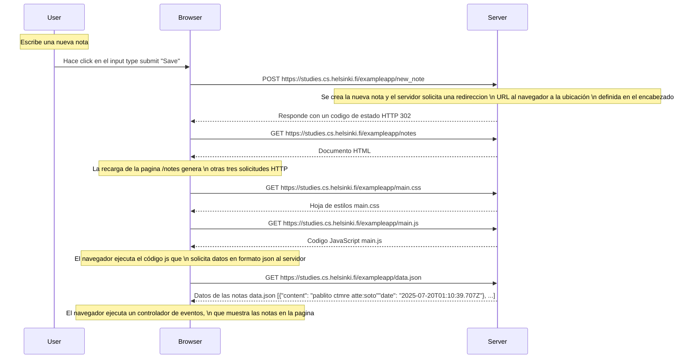

```mermaid
    sequenceDiagram
        participant User
        participant Browser
        participant Server

        Note over User: Escribe una nueva nota
        User->>Browser: Hace click en el input type submit "Save" 
        Browser->>Server: POST https://studies.cs.helsinki.fi/exampleapp/new_note
        Note over Server: Se crea la nueva nota y el servidor solicita una redireccion \n URL al navegador a la ubicación \n definida en el encabezado 
        Server-->>Browser: Responde con un codigo de estado HTTP 302
        Browser->>Server: GET https://studies.cs.helsinki.fi/exampleapp/notes
        Server-->>Browser: Documento HTML
        Note over Browser: La recarga de la pagina /notes genera \n otras tres solicitudes HTTP
        Browser->>Server: GET https://studies.cs.helsinki.fi/exampleapp/main.css
        Server-->>Browser: Hoja de estilos main.css
        Browser->>Server: GET https://studies.cs.helsinki.fi/exampleapp/main.js
        Server-->>Browser: Codigo JavaScript main.js
        Note over Browser: El navegador ejecuta el código js que \n solicita datos en formato json al servidor
        Browser->>Server: GET https://studies.cs.helsinki.fi/exampleapp/data.json
        Server-->>Browser: Datos de las notas data.json [{"content": "pablito ctmre atte:soto""date": "2025-07-20T01:10:39.707Z"}, ...]
        Note over Browser: El navegador ejecuta un controlador de eventos, \n que muestra las notas en la pagina
```