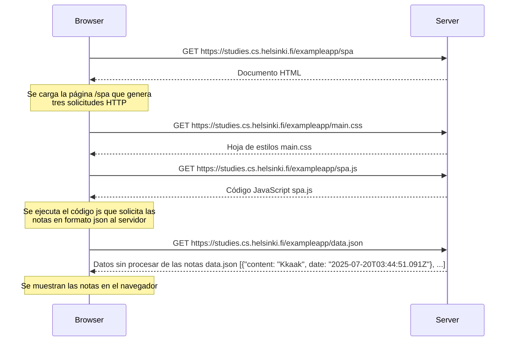

```mermaid
    sequenceDiagram
        participant Browser
        participant Server

        Browser->>Server: GET https://studies.cs.helsinki.fi/exampleapp/spa 
        Server-->>Browser: Documento HTML
        Note over Browser: Se carga la página /spa que genera <br> tres solicitudes HTTP
        Browser->>Server: GET https://studies.cs.helsinki.fi/exampleapp/main.css
        Server-->>Browser: Hoja de estilos main.css
        Browser->>Server: GET https://studies.cs.helsinki.fi/exampleapp/spa.js
        Server-->>Browser: Código JavaScript spa.js
        Note over Browser: Se ejecuta el código js que solicita las <br> notas en formato json al servidor
        Browser->>Server: GET https://studies.cs.helsinki.fi/exampleapp/data.json
        Server-->>Browser: Datos sin procesar de las notas data.json [{"content: "Kkaak", date: "2025-07-20T03:44:51.091Z"}, ...]    
        Note over Browser: Se muestran las notas en el navegador
```